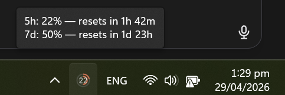
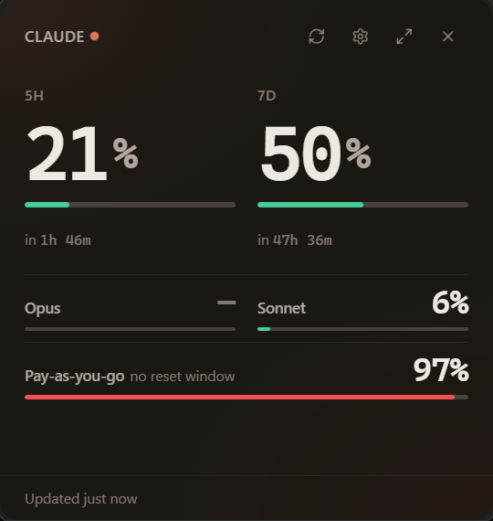
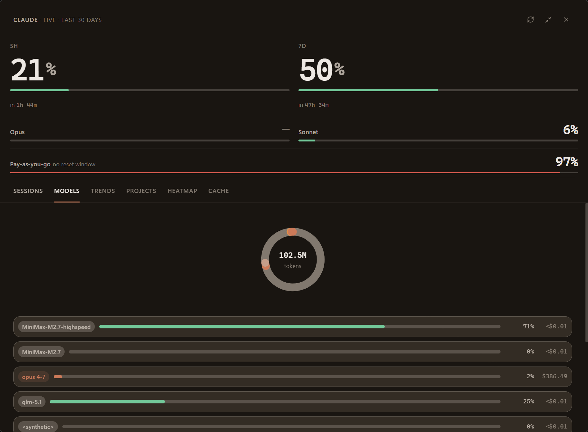
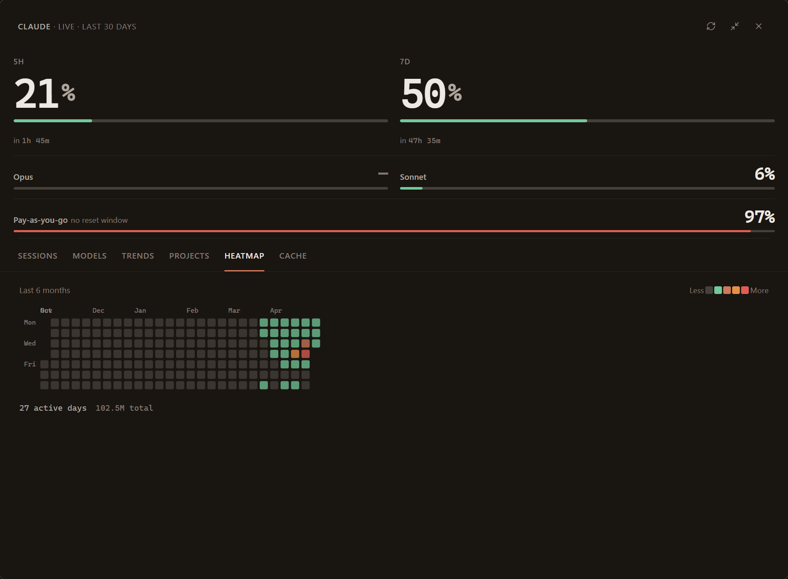
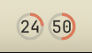
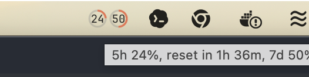
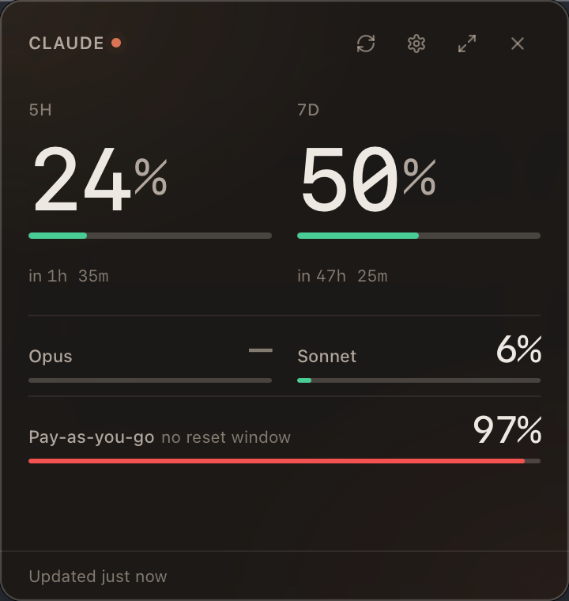
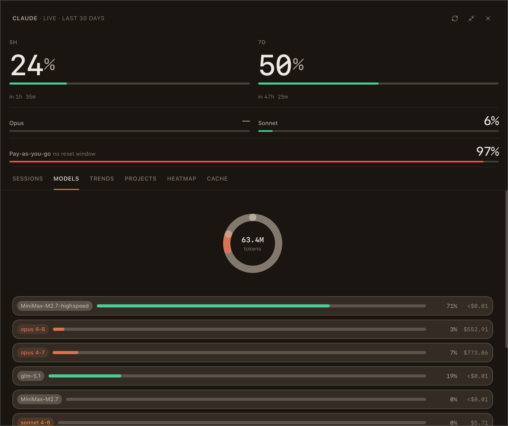
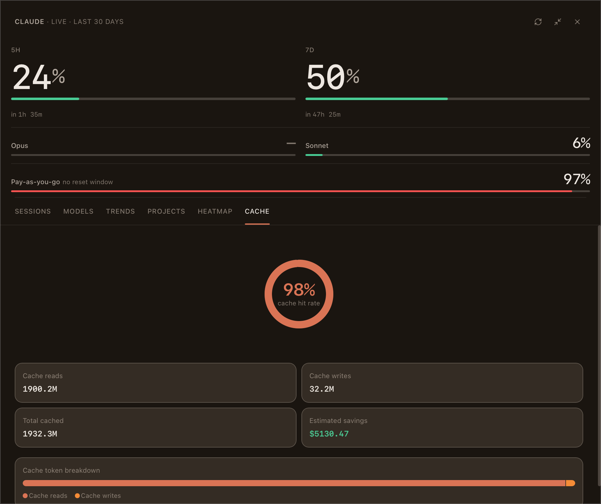

# Claude Limits

A menu-bar app that puts your Claude rate limits one glance away — on macOS and Windows, with the same designed experience.

> Am I about to hit my limit, and if so, when?

That's the question Claude Limits answers. The tray icon shows your live 5-hour percentage as a ring badge, so the answer is visible without opening anything. Hover for a one-line summary; click for the compact popover; expand for six tabs of analytics.

## Screenshots

### Windows 11

The tray icon shows the live 5-hour percentage as a ring badge — the answer to "where am I at?" is visible without opening anything. Hover for a one-line text summary; click for the full popover.

<p align="center">
  
</p>

<p align="center">
  
</p>

<p align="center">
  
</p>

Click the expand arrow for the full report — Sessions, Models, Trends, Projects, Heatmap, and Cache tabs.

<p align="center">
  
</p>

<p align="center">
  
</p>

### macOS

Same layout, rendered with native vibrancy. The tray icon shows the same live ring badge in the menu bar; hover for a one-line summary, click for the popover.

<p align="center">
  
</p>

<p align="center">
  
</p>

<p align="center">
  
</p>

Click the expand arrow for the full report — Sessions, Models, Trends, Projects, Heatmap, and Cache tabs.

<p align="center">
  
</p>

<p align="center">
  
</p>

## What makes it different

Most Claude usage trackers fall into one of two shapes — CLI tools you have to remember to run (`ccusage`, terminal monitors), or stock menu-bar widgets with a percent number and not much else. Claude Limits is the third shape: a designed app with both visual craft and analytical depth.

- **Glance, don't query.** The ring badge on the menu bar is the answer. No window to open, no command to run — your 5-hour utilization is always in peripheral vision.
- **Native feel, not native boring.** macOS vibrancy and Windows 11 Mica (acrylic on Win10), system fonts, monospace numerics, springs not easings. The reference is macOS Control Center and Raycast, not stock SwiftUI. Every color, radius, spacing, and animation comes from one token set.
- **Real analytics depth.** Six tabs in the expanded report — Sessions, Models, Trends, Projects, Heatmap, and Cache — sourced from your local Claude Code transcripts. Not a single bar with a percent on it.
- **Cross-platform parity.** Same layout, same interactions, same design language on macOS and Windows 10/11. Rare in this category — most native menu-bar apps are macOS-only.
- **Tier-aware cost math.** Sonnet 4's 1M-context tier (rates double above 200k input) and the 5-minute / 1-hour cache write split are calculated correctly, not approximated.

## Features

- **Live tray badge** — 5-hour percentage as a ring around the menu-bar icon, refreshed at your configured interval. Pulled from Anthropic's official usage endpoint — the same numbers their console shows.
- **Hover summary** — 5h and 7d percentages with reset times in a single line, without clicking.
- **Compact popover** — 5H / 7D buckets, per-model bars (Opus, Sonnet), and pay-as-you-go credits when enabled.
- **Expanded report** — Sessions, Models, Trends, Projects, Heatmap, and Cache tabs, sourced from local Claude Code JSONL transcripts.
- **Burn-rate projection** — extrapolates your current pace and shows where utilization will land at reset, color-cued against your threshold.
- **Threshold notifications** — warn / danger levels you choose; one alert per bucket cycle.
- **Tier-aware cost** — Sonnet 4's 1M-context tier and 5-minute / 1-hour cache write split, calculated correctly.
- **Cross-platform** — macOS (vibrancy) and Windows 10/11 (Mica / acrylic), same design.

## Install

No signed release yet — build from source:

```bash
pnpm install
pnpm tauri dev
```

When binaries ship, first-launch notes for unsigned apps:

- **macOS:** `xattr -d com.apple.quarantine "/Applications/Claude Limits.app"` or right-click → Open from Finder.
- **Windows:** SmartScreen → "More info" → "Run anyway". WebView2 is required on Windows 10 (Windows 11 ships it).

## Authentication

By default Claude Limits reuses your existing Claude Code credentials from the OS keychain — no separate sign-in. If you'd rather authenticate independently, an OAuth 2.0 + PKCE paste-back flow is available in Settings.

The app never logs in on your behalf. It reads the token your OS already holds and uses it only against `api.anthropic.com`.

## Privacy

- All data stays on your machine. Usage history is in SQLite at `~/Library/Application Support/com.claude-limits.ClaudeLimits/data.db` (macOS) or the platform equivalent on Windows.
- The only outbound traffic is to Anthropic's official API.
- No telemetry, no analytics, no third-party services.

## Stack

Tauri v2 (Rust + WebView) · React 19 · TypeScript · Tailwind CSS v4 · Framer Motion · Recharts · SQLite.

## Development

```bash
# Frontend typecheck
pnpm exec tsc --noEmit

# Backend tests (75+ unit + integration tests)
cd src-tauri && cargo test
```

## License

MIT
