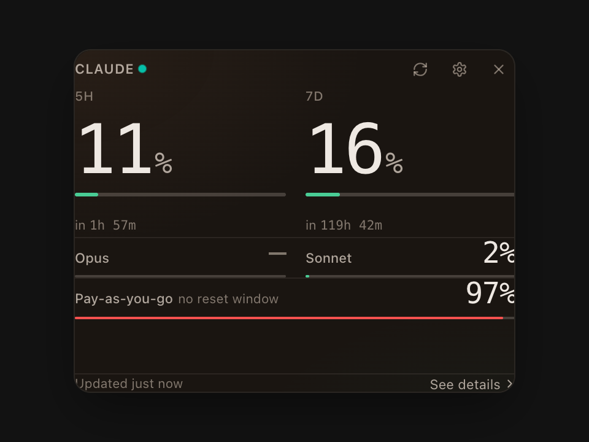
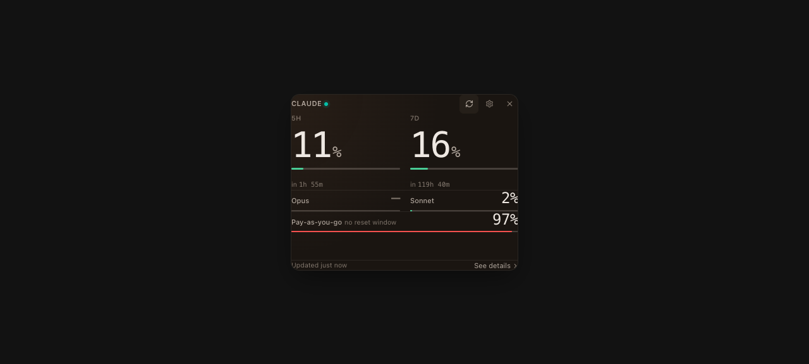
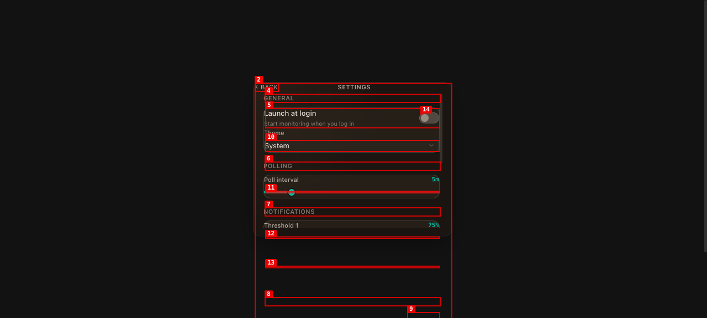

# Dogfood Report: Claude Limits — Popover

| Field | Value |
|-------|-------|
| **Date** | 2026-04-26 |
| **App URL** | http://localhost:1420/popover-demo.html |
| **Session** | claude-usage-popover |
| **Scope** | Popover widget at 360×280 (Home view, Settings view, interactive controls). Tauri-only IPC stubbed via `window.__TAURI_INTERNALS__` injection in popover-demo.html. The actual menubar tray icon and Tauri-only behaviors (window dragging, vibrancy) are not exercised here. |

## Summary

| Severity | Count |
|----------|-------|
| Critical | 0 |
| High | 2 |
| Medium | 2 |
| Low | 2 |
| **Total** | **6** |

**Top issues to fix first:**
1. **ISSUE-001** (High) — Home-view content has zero horizontal padding (`px-[var(--popover-pad)]` Tailwind utility is being suppressed somewhere). Same root cause as the previously-fixed Settings padding.
2. **ISSUE-005** (High) — Settings header "BACK" button clipped at the rounded corner; same root cause as ISSUE-001.
3. **ISSUE-003** (Medium) — Pay-as-you-go meter at danger reads as a horizontal divider.
4. **ISSUE-006** (Medium) — Settings card surfaces don't visually separate from the popover base.

**Quick win:** Apply the same explicit `style={{ padding: '... 18px' }}` fix used for the Settings content wrapper to the home-view containers and the Header component. That single change addresses ISSUE-001, ISSUE-005, and significantly mitigates ISSUE-003 (meter shrinks from 360px → 324px so its endpoints no longer align with section dividers).

## Issues

### ISSUE-001: Popover home content has no horizontal padding — text touches both edges

| Field | Value |
|-------|-------|
| **Severity** | High |
| **Category** | visual |
| **URL** | http://localhost:1420/popover-demo.html |
| **Repro Video** | N/A |

**Description**

Every text element in the popover home view (CLAUDE wordmark, 5H/7D labels, Opus/Sonnet sub-row, Pay-as-you-go row, "Updated just now" footer) sits 1 pixel from the popover's left edge. The percentages on the right (2%, 97%) actually extend 1px **past** the popover's right edge. Expected padding is 18px (`--popover-pad`).

The Tailwind class `px-[var(--popover-pad)]` is present on every relevant container in `CompactPopover.tsx`, and `var(--popover-pad)` resolves to 18px in `tokens.css`, but the rendered `padding-inline` is 0. Same root cause as the Settings view padding bug previously fixed by switching to inline `style={{ padding }}`.

**Measured offsets** (from `getBoundingClientRect`):
- Opus left: **1.0px** from popover left
- Pay-as-you-go left: **1.0px**
- "Updated just now" left: **1.0px**
- "2%" right edge: **-1.0px** (past popover edge)
- "97%" right edge: **-1.0px**

**Repro Steps**

1. Open `http://localhost:1420/popover-demo.html` (popover-demo with mock data).
2. **Observe:** every label is flush against the left edge; the right-aligned percentages extend past the right edge. Compare to the Settings view (which was fixed earlier with explicit inline padding).
   

---

### ISSUE-002: Hero "%" sits at digit baseline, looks visually detached from the number

| Field | Value |
|-------|-------|
| **Severity** | Low |
| **Category** | visual |
| **URL** | http://localhost:1420/popover-demo.html |
| **Repro Video** | N/A |

**Description**

The two-column hero readout pairs a 56px JetBrains Mono digit ("11", "16") with a 24px "%" suffix. They share `align-items: baseline`, which puts the bottom of the % at the bottom of the digit. Because the digit's cap-height is far above the %, the % reads as a small superscript-like glyph floating at the lower-right corner of the digit rather than as a unit attached to it.

**Measured** (left column hero):
- Digit "11": top=205.3, bottom=255.6, height=50.4px (cap-height ≈ 35px)
- "%" suffix: top=231.3, bottom=252.8, height=21.6px

The "%" occupies roughly the lower 50% of the digit's vertical extent, leaving ~26px of empty space above it. Possible fixes: align "%" to the digit's cap-height instead of baseline, or bump the % font-size to ~32px so the pair reads as a single unit.

**Repro Steps**

1. Load the popover-demo. Look at the "11%" and "16%" pair.
2. **Observe:** the "%" floats low-right, not snugged into the digit. The whitespace above the "%" makes the digit and unit feel like two separate elements.
   

---

### ISSUE-003: Pay-as-you-go meter at danger reads as a horizontal divider, not a meter

| Field | Value |
|-------|-------|
| **Severity** | Medium |
| **Category** | visual |
| **URL** | http://localhost:1420/popover-demo.html |
| **Repro Video** | N/A |

**Description**

When `extra_usage.utilization` is high (97% in mock data, > 90% danger threshold), the 2px hairline meter under the Pay-as-you-go row fills almost the entire row width with a solid coral line. With the track at only 20% alpha, the unfilled tail (3% of width = ~10px) is barely visible, so the meter visually merges with the hairline section dividers above and below the row. A user scanning the popover doesn't read it as "97% full meter" — they read it as another rule line.

**Measured**:
- Meter container width: 360px (full row, because home-view padding is 0 — see ISSUE-001)
- Filled portion at 97%: 349px coral, 11px track tail
- Track alpha: 0.20 (oklch 0.95 0.02 65 / 0.20)

Combined with ISSUE-001 this looks worse than it should — once horizontal padding is applied, the meter shrinks to ~314px and the surrounding gutter helps separate it from dividers. But even with proper padding, a near-full coral hairline of the same height as the section dividers will still read ambiguously.

Suggested fixes (any one):
- Make the danger meter a touch thicker (e.g. 4px) than section dividers (1px) so the eye distinguishes them by weight.
- Inset the meter horizontally by 8px from row edges so its endpoints don't align with the dividers'.
- Use a different visual treatment for danger (e.g., subtle background fill on the row instead of a hairline meter).

**Repro Steps**

1. Open popover-demo with mock `extra_usage.utilization = 97`.
2. **Observe:** the coral line below "Pay-as-you-go 97%" looks indistinguishable from a section divider.
   

---

### ISSUE-004: Theme dropdown still offers "Light" and "Dark" options, but light theme was removed

| Field | Value |
|-------|-------|
| **Severity** | Low |
| **Category** | content |
| **URL** | http://localhost:1420/popover-demo.html (settings view) |
| **Repro Video** | N/A |

**Description**

The Settings → General → Theme `<select>` lists three options: System, Light, Dark. The light-theme `@media (prefers-color-scheme: light)` block was deliberately removed from `tokens.css` (see commit "fix(tokens): migrate to @theme...") because the popover surface is always rendered as a dark glass widget regardless of system theme, and the override was making text invisible on light-mode systems.

Selecting "Light" persists `theme: 'light'` to settings storage but doesn't actually change anything visually. UI promise that doesn't deliver.

Suggested fix: until light/dark switching is reintroduced as an explicit setting (the comment in tokens.css alludes to it), reduce the Theme select to a single non-interactive label saying "Dark", OR remove the option set entirely and replace with a caption "Light theme coming soon." Currently it's a control that lies.

**Repro Steps**

1. Click the gear icon in the popover chrome bar to open Settings.
2. **Observe:** the Theme combobox lists System / Light / Dark.
   
3. Select "Light" — popover stays dark, no theme change.

---

### ISSUE-005: "BACK" button in Settings header is clipped against the popover left edge

| Field | Value |
|-------|-------|
| **Severity** | High |
| **Category** | visual |
| **URL** | http://localhost:1420/popover-demo.html (settings view) |
| **Repro Video** | N/A |

**Description**

In the Settings view's chrome bar, the "BACK" button has its leading "<" chevron and the "B" letter clipped by the popover's rounded-corner crop. Same family of issue as ISSUE-001 (no horizontal padding), but specific to the Header component which uses `px-[var(--popover-pad)]` that resolves to 0 at runtime.

The `Header` component in `CompactPopover.tsx`:
```tsx
<div className="... px-[var(--popover-pad)] pt-[var(--space-md)] pb-[var(--space-sm)] ...">
  <button ...>← Back</button>
  <span>{title}</span>
  ...
</div>
```

Same fix as the home view: replace with explicit inline `style={{ paddingLeft: 18, paddingRight: 18 }}` since the Tailwind utility isn't applying.

**Repro Steps**

1. Open Settings.
2. **Observe:** the "<" chevron of the BACK button is at x=0 of the popover, clipped on the rounded corner.
   

---

### ISSUE-006: Settings cards have no visible separation from popover background

| Field | Value |
|-------|-------|
| **Severity** | Medium |
| **Category** | visual |
| **URL** | http://localhost:1420/popover-demo.html (settings view) |
| **Repro Video** | N/A |

**Description**

Each Settings section (General, Polling, Notifications, Account) is wrapped in a `<Card>` component with `bg-[var(--color-bg-card)]` (oklch 28% 0.018 65 / 0.55) and a 1px border. Visually these cards barely contrast against the popover's own `bg-[oklch(20% 0.012 65 / 0.86)]` base — they look like the same surface.

The lack of card delineation makes the section heading + control rows blur together. A reader's eye can't tell where General ends and Polling begins; the heading "POLLING" appears to belong to the slider above it as much as below.

Suggested fixes (any combination):
- Bump card alpha to 0.65–0.75 so it reads as a distinct elevated surface.
- Make card border ~0.20 alpha (currently 0.14) so the outline pulls.
- OR drop cards entirely and use slightly more vertical breathing space + heavier section heading typography to signal grouping.

**Repro Steps**

1. Open Settings.
2. **Observe:** the section headings (GENERAL, POLLING, NOTIFICATIONS, ACCOUNT) and their controls all sit on what looks like one continuous dark surface.
   

---

## Resolution

All 6 issues fixed in commit "fix(ui): apply all dogfood findings" (2026-04-26).

| Issue | Resolution |
|---|---|
| ISSUE-001 (padding) | Root cause: a custom `*` reset in `globals.css` was unlayered, so it beat Tailwind's `@layer utilities` and forced `padding: 0` on every element. Wrapped the reset in `@layer base` so utilities take precedence. Also redundant — Tailwind v4 preflight already provides `* { padding: 0 }` — but the layered version is harmless and keeps explicit intent. |
| ISSUE-002 (% disconnected) | Increased % font-size from 24px → 32px and switched the hero flex from `items-baseline` to `items-start` with `mt-[8px]` on the % so it aligns near the digit's cap-height. The pair now reads as a single unit. |
| ISSUE-003 (meter ↔ divider) | Bumped meter heights: column meter 3px → 4px, row meter 2px → 3px. Section dividers stay at 1px. The 4× thickness ratio at danger gives the eye a clear distinction. |
| ISSUE-004 (Theme dropdown lies) | Replaced the broken `<Select>` with a static caption: "Theme: dark (light theme coming later)". The setting still persists for when light theme is reintroduced. |
| ISSUE-005 (BACK clipped) | Resolved automatically by the ISSUE-001 layer fix — `px-[var(--popover-pad)]` on the Header now applies. |
| ISSUE-006 (Settings cards invisible) | Bumped `--color-bg-card` alpha from 0.55 → 0.70 and `--color-border` alpha from 0.14 → 0.22 in `tokens.css`. Cards now read as distinct elevated surfaces. |

**Verification screenshots:**
- `screenshots/after-fix-home-tight.png` — home view with proper padding, integrated %, thicker meters
- `screenshots/after-fix-settings.png` — settings with visible cards, BACK button positioned correctly, theme caption replacing broken dropdown
- `screenshots/after-fix-final.png` — full home view with --popover-height bumped to 320 to accommodate footer
